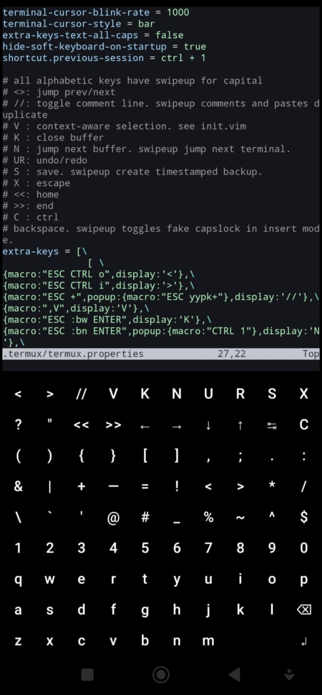

There are several Android code editors available on the Play Store, but **Termux** combined with **Neovim** stands out as a superior choice. However, vim-motions aren’t optimized for typing with a **thumb**. To address this issue, I created the **BacioneJS** editor IDE, which is designed specifically for programming small JavaScript games on mobile devices offline.  
  
For BacioneJS, see https://github.com/bacionejs/editor  


For complex needs, try Termux/Neovim.  

---

**Termux/Neovim**  
https://github.com/termux/termux-app  


A good keyboard setup is an important part of **reducing frustration** when coding on a phone with a thumb. My configuration below supports these **shortcuts**:  
- save
- backup
- close file
- jump prev/next
- jump next buffer
- jump next terminal
- undo/redo
- toggle highlight
- toggle comments. swipeup comments and pastes duplicate
- context-aware selection

---

Using termux extra-keys **for entire keyboard** (hack)  
https://wiki.termux.com/wiki/Touch_Keyboard  

`termux.properties`
```properties
extra-keys-text-all-caps = false
hide-soft-keyboard-on-startup = true
shortcut.previous-session = ctrl + 1

# For tablets add 9 blank keys in the left of each row to push the keyboard to the right side for ease of right-thumb typing.  
extra-keys = [\
[ \
{key:HOME,display:'<<'}, {key:END,display:'>>'},\
'DOWN', 'UP', \
{macro:"ESC CTRL o",display:'<'}, {macro:"ESC CTRL i",display:'>'},\
{macro:"ESC :bw ENTER",display:'K'},\
{macro:"ESC :bn ENTER",popup:{macro:"CTRL 1"},display:'N'},\
{macro:"ESC :w ENTER",popup:{macro:",B"},display:'💾'},\
{key:ESC,popup:{key:CTRL},display:'X'}\
], \
[ \
'?', 'QUOTE', \
'LEFT', 'RIGHT', \
{macro:",V",display:'📄'}, {key:p,display:'📋'},\
{macro:"ESC u",display:'↩️'}, {macro:"ESC CTRL r",display:'↪️'},\
{macro:"ESC +",popup:{macro:"ESC yypk+"},display:'//'},\
'TAB'\
], \
[ '(', ')', '{', '}', '[', ']', ',', ';', '.', ':'], \
[ '&', '|', '+', '-', '=', '!', '<', '>', '*', '/'], \
[ 'BACKSLASH', '`', 'APOSTROPHE', '@', '#', '_', '%', '~', '^', '$'], \
[ '1', '2', '3', '4', '5', '6', '7', '8', '9', '0'], \
[ {key:'q',popup:'Q'},{key:'w',popup:'W'},{key:'e',popup:'E'},{key:'r',popup:'R'},{key:'t',popup:'T'},{key:'y',popup:'Y'},{key:'u',popup:'U'},{key:'i',popup:'I'},{key:'o',popup:'O'},{key:'p',popup:'P'}], \
[ {key:'a',popup:'A'},{key:'s',popup:'S'},{key:'d',popup:'D'},{key:'f',popup:'F'},{key:'g',popup:'G'},{key:'h',popup:'H'},{key:'j',popup:'J'},{key:'k',popup:'K'},{key:'l',popup:'L'},{macro:"CTRL ^",display:'⇧'}], \
[ {key:'z',popup:'Z'},{key:'x',popup:'X'},{key:'c',popup:'C'},{key:'v',popup:'V'},{key:'b',popup:'B'},{key:'n',popup:'N'},{key:'m',popup:'M'},{key:'SPACE',display:' '},{key:'BKSP'},'ENTER'] \
]
```

---
`init.vim`
```vimscript
" Hack for extra-keys capslock, activated with c-^. 
for c in range(char2nr('A'), char2nr('Z'))
  execute 'lnoremap ' . nr2char(c+32) . ' ' . nr2char(c)
  execute 'lnoremap ' . nr2char(c) . ' ' . nr2char(c+32)
endfor

" backs up current file to ~/delete/timestampedfile
nnoremap ,B :let fname = substitute(fnamemodify(expand('%:p'), ':h:t') . '/' . expand('%:t'), '/', '_', '') . '_' . strftime('%Y%m%d_%H%M%S') \| call mkdir(expand('~/delete'), 'p') \| call system('cp -n ' . shellescape(expand('%:p')) . ' ' . expand('~/delete/') . fname) \| echo 'Copied to: ~/delete/' . fname<CR>

" toggles * highlight. also prevents auto-advance.
nnoremap <silent><expr> * (&hls && v:hlsearch ? ':noh' : ':let @/= "\\<" . expand("<cword>") . "\\>" \| set hls')."\n"

" toggles comments
nnoremap + :call CommentReplaceAndMove()<CR>
function! CommentReplaceAndMove()
    let c = substitute(&commentstring, '%s', '', '')
    execute 'silent! :s#^#'.c.'#e|s#^'.c.c.'##e'
    normal! j
endfunction

" Context-aware selection. for example yiw becomes only one click
" also works with paragraphs, quotes and blocks
inoremap ,V <Esc>:call SuperSelect()<CR>
nnoremap ,V :call SuperSelect()<CR>
" extends selection
vmap ,V :<C-u>call ExtendSelection()<CR>
function! SuperSelect() | let c=getline('.')[col('.')-1] | if c=~'\w'|normal! viw|elseif c=~'"'|normal! va"|elseif c=~'^\s*$'|normal! jvap|elseif c=~'[][}{)(]'|normal! v%|if line("'>")-line("'<")+1>1|normal! V|if c=~'[]})]'|normal! o|endif|let i=line('.')+1|while i<=line('$')&&getline(i)=~#'^\s*$'|normal! j|let i+=1|endw|endif|endif|normal! ygv|endfunction
function! ExtendSelection() | normal! gvl | let c=getline('.')[getpos("'>")[2]] | let c2=getline('.')[getpos("'>")[2]+1] | if c=~'[[({]'|normal! %|elseif c=~'\w'&&c2=~'\w'|normal! e|endif|endfunction
```

