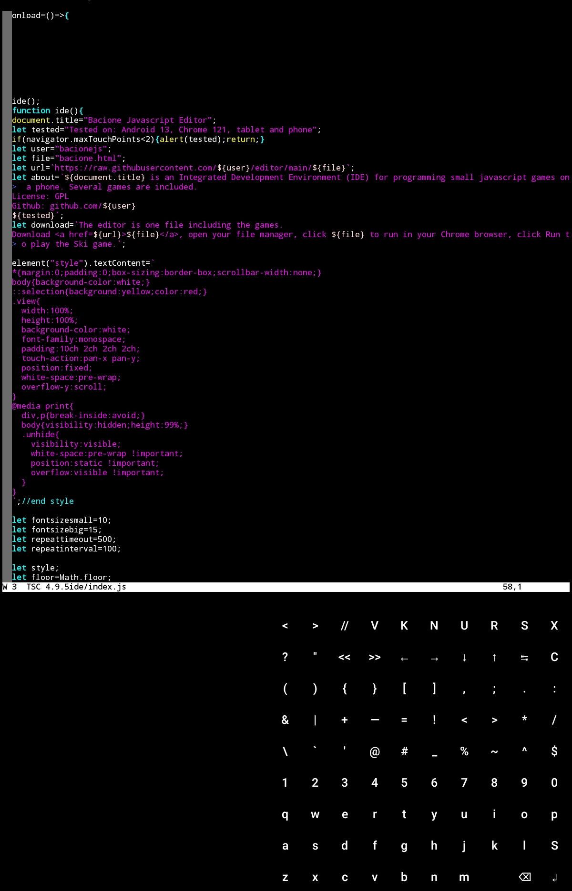

## How I wrote bacionejs (https://github.com/bacionejs/editor) on an Android tablet
## Installed
- termux
- nodejs
- apache
- neovim
- conquer of completion

## Configured termux extra-keys to replace entire keyboard
- termux.properties
- init.vim

## Access with or without wifi
- Access Apache via wifi and localhost 127.0.0.1:8080 (no internet required).
- If no wifi, then use hotspot, but use back, then forward in browser to refresh because normal refresh doesn't work with hotspot.
- Or edit in neovim via ~/storage/downloads and open in browser from file manager. This method only works if it is one monolithic file with a html suffix. And to prevent syntax highlighting issues when editing a combo html/javascript file, use neovim :syntax sync fromstart.
